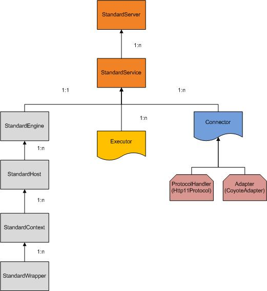

# Introduction

to learn spring web mvc.

### 在spring mvc 中是WebApplicationContext, 继承了ApplicationContext ,就多了一个方法，获取ServletContext.

### hierarchy
 
-  在web.xml中 使用ContextLoaderListener配置RootWebApplicationContext.可以初始化一些公共的service/repository等。
-  dispatcherServlet 继承自RootWebApplicationContext。
- 覆盖
DefaultListableBeanFactory.allowBeanDefinitionOverriding 默认允许覆盖

可以只配置dispatcherServlet。
所有的controller必须在dispatcherServlet配置的容器中。
```xml
<context-param>
    <param-name>contextConfigLocation</param-name>
   <param-value>classpath:applicationContext.xml</param-value>
  </context-param>
```
用来初始化ContextLoaderListener配置RootWebApplicationContext。

```xml
    <init-param>
      <param-name>contextConfigLocation</param-name>
      <param-value>/WEB-INF/mvc-config.xml</param-value>
    </init-param>
```
用来初始化dispatcherServlet的webApplicationContext. 
1. 通过param-value指定配置文件。
2. param-value为空，不使用配置文件初始化。
3. 不配置init-param，默认使用`[dispatcherServlet名称]`-config.xml.
4. controller 最好在DispatcherServlet中扫描，如果在RootWebApplication 中扫描，WebApplicationContext 中不能配置`<mvc:annotation-driven></mvc:annotation-driven> `,否则会使用子容器中的RequestMappingInfoHandlerMapping。


### mvc:annotation-driven
这个是必须的，用来启动springmvc的基础设施。

### context:annotation-config
<context:annotation-config/> only looks for annotations on beans in the same application context in which it is defined. This means that, if you put <context:annotation-config/> in a WebApplicationContext for a DispatcherServlet, it only checks for @Autowired beans in your controllers, and not your services.
The use of <context:component-scan> implicitly enables the functionality of <context:annotation-config>. There is usually no need to include the <context:annotation-config> element when using <context:component-scan>.


### process


来自[http://gearever.iteye.com/blog/1841586](http://gearever.iteye.com/blog/1841586)

```
Tomcat
  Server 一个tomcat实例
  |  1:n
  |-- service
         | 
         |-- connector 
         |       
         |-- executor
         |  request/response
         |-- engine
               |
               |-- host
               |-- context (web applications)

     
Spring
request -> Locale Resolver-> theme Resolver ->|Interceptors                | 
                                 ^            |      preHandle             |    
                                 |            |      -- MappingHandler --  |  ExceptionsChain             
                        View Resolver<-model<-|      postHandle            |     
                                              |      afterCompletion       |          
                                              |                            |
```

Note that postHandle is less useful with @ResponseBody and ResponseEntity methods for which the response is written and committed within the HandlerAdapter and before postHandle. That means it is too late to make any changes to the response, such as adding an extra header. For such scenarios, you can implement ResponseBodyAdvice and either declare it as an Controller Advice bean or configure it directly on RequestMappingHandlerAdapter.

### spring session
使用SpringHttpSessionConfiguration.springSessionRepositoryFilter 注册bean
所以必须在ContextLoaderListener初始化session配置，并且filter名称必须是springSessionRepositoryFilter

## notice
- BeanPostProcessor/BeanFactoryPostProcessor 只对当前容器中的bean有效
- context:component-scan 默认会开启context:annotation-config